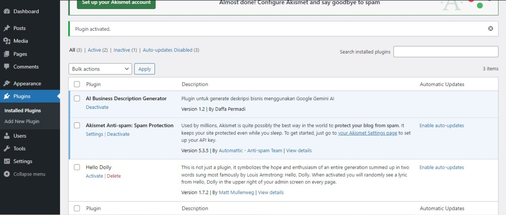
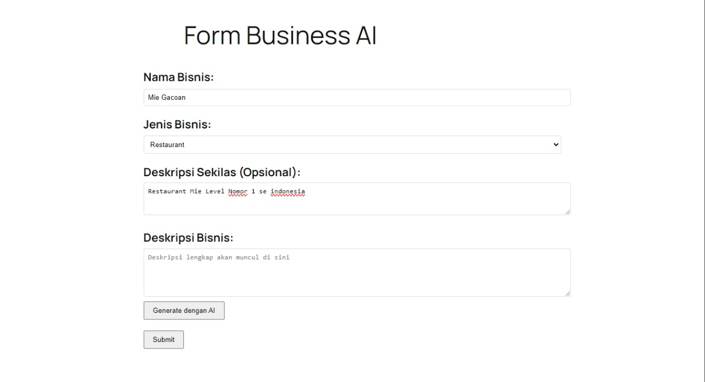
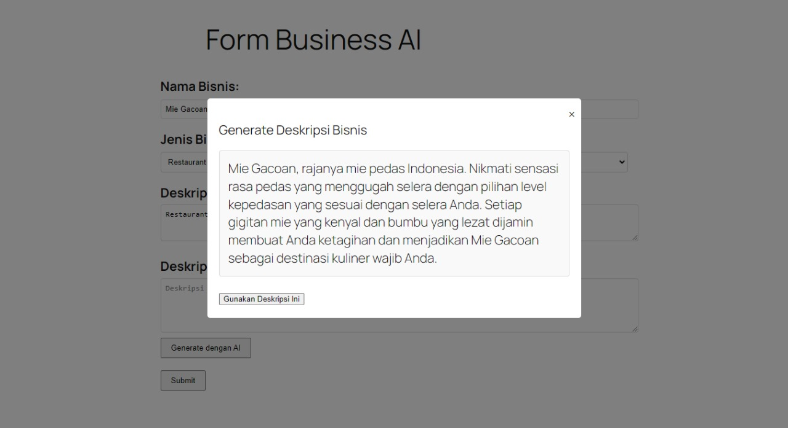

# AI Business Description Generator

Plugin WordPress sederhana untuk menghasilkan deskripsi bisnis profesional menggunakan Google Gemini AI.

📸 Preview

Plugin setelah di Install


Form input untuk generate deskripsi bisnis


Modal hasil generate AI

## 🚀 Fitur

- Menghasilkan deskripsi bisnis profesional menggunakan AI
- Mendukung berbagai jenis bisnis (retail, restaurant, jasa, teknologi, dll)
- Form input yang mudah digunakan
- Integrasi dengan Google Gemini AI
- Deskripsi sekilas opsional untuk hasil yang lebih personal
- Tampilan modal yang responsif
- Shortcode untuk fleksibilitas penempatan form

## 📋 Persyaratan

- WordPress 5.0 atau lebih baru
- PHP 7.4 atau lebih baru
- API Key dari Google AI Studio (Gemini)

## 💻 Instalasi

1. Download repository ini sebagai ZIP
2. Upload ke WordPress melalui menu Plugins > Add New > Upload Plugin
3. Aktifkan plugin melalui menu Plugins
4. Dapatkan API key dari [Google AI Studio](https://makersuite.google.com/app/apikey)
6. Masukkan API key di file utama plugin
8. Gunakan shortcode `[business_description_form]` di halaman atau post yang diinginkan

## 🔧 Konfigurasi

1. Buka file utama plugin
2. Cari baris berikut:
```php
$api_key = 'YOUR_API_KEY_HERE';
```
3. Ganti dengan API key Anda:
```php
$api_key = 'AI***************************';
```

## 📝 Penggunaan

1. Tambahkan shortcode `[business_description_form]` ke halaman atau post
2. Isi form dengan informasi bisnis:
   - Nama bisnis (wajib)
   - Jenis bisnis (wajib)
   - Deskripsi sekilas (opsional)
3. Klik tombol "Generate dengan AI"
4. Review hasil deskripsi di modal
5. Klik "Gunakan Deskripsi Ini" untuk menggunakan hasil generate

## 🎯 Contoh Output

Input:
```
Nama Bisnis: Warung Kopi Kenangan
Jenis Bisnis: Restaurant
Deskripsi Sekilas: Warung kopi yang menyajikan kopi lokal dengan konsep modern
```

Output:
```
Warung Kopi Kenangan menghadirkan pengalaman ngopi premium dengan racikan kopi lokal pilihan dalam nuansa modern yang nyaman. Menggabungkan cita rasa autentik kopi nusantara dengan konsep ruang kontemporer, kami menawarkan tempat ideal untuk menikmati kopi berkualitas dan bersantai bersama kerabat.
```

## 🤝 Kontribusi

Kontribusi sangat diterima! Untuk berkontribusi:

1. Fork repository ini
2. Buat branch baru (`git checkout -b fitur-baru`)
3. Commit perubahan Anda (`git commit -m 'Menambah fitur baru'`)
4. Push ke branch (`git push origin fitur-baru`)
5. Buat Pull Request

## 📄 Lisensi

Plugin ini dilisensikan di bawah [GPL v3 atau yang lebih baru](https://www.gnu.org/licenses/gpl-3.0.html)

## ⭐ Penghargaan

- Terima kasih kepada [Google](https://ai.google.dev/) untuk API Gemini
- Plugin ini dibuat sebagai bagian dari test teknis untuk Triastudio.co

## 📞 Support

Jika Anda menemukan masalah atau memiliki saran, silakan buat issue di repository ini.

Daffa Permadi
